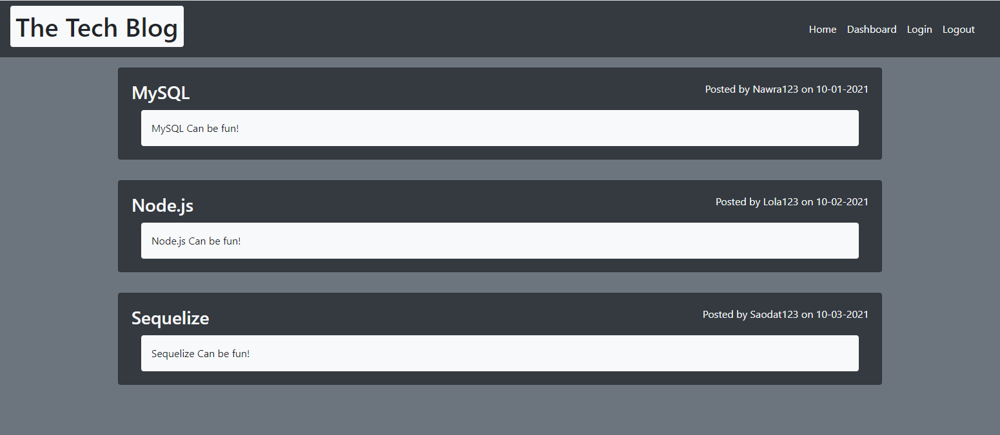

# Tech Blog
## Description
A CMS-style blog where developers can publish their blog posts and comment on other developers’ posts as well. This app follows the MVC paradigm in its architectural structure, using Handlebars.js as the templating language, Sequelize as the ORM, and the express-session npm package for authentication.
## Usage
Link - [Tech Blog](https://vast-fjord-09411.herokuapp.com/)
- API for all the users: [https://vast-fjord-09411.herokuapp.com/api/users](https://vast-fjord-09411.herokuapp.com/api/users)
- API for all the blogs, their comments, and their users: [https://vast-fjord-09411.herokuapp.com/api/blogs](https://vast-fjord-09411.herokuapp.com/api/blogs)
- API for all the comments: [https://vast-fjord-09411.herokuapp.com/api/comments](https://vast-fjord-09411.herokuapp.com/api/comments)

  

  
## Credits
Zach Smith - [GitHub Profile](https://github.com/Lemelisk27)  
## Questions  
If you have any questions you can contact me directly at Lemelisk27@gmail.com. You can also find more of my work on GitHub at [Lemelisk27](https://github.com/Lemelisk27)